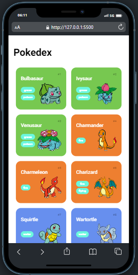
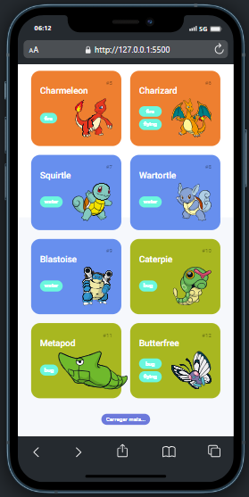
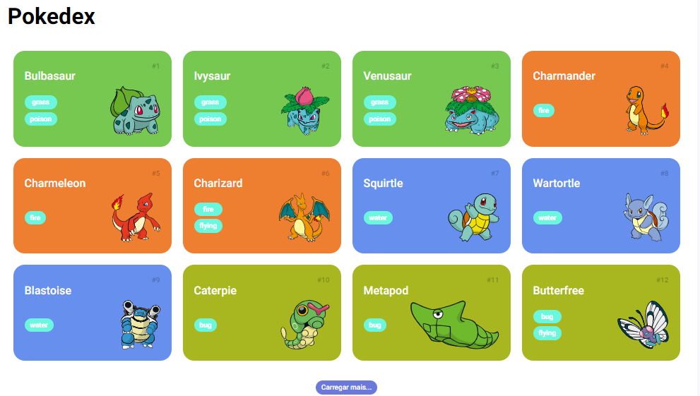

<h1 align="center"> Pokedéx </h1>

Site baseado na pokedéx buscando informações, reestruturando os dados para melhor visualização do código.  

  <a href="#-tecnologias">Tecnologias</a>&nbsp;&nbsp;&nbsp;|&nbsp;&nbsp;&nbsp;
  <a href="#-projeto">Projeto</a>&nbsp;&nbsp;&nbsp;|&nbsp;&nbsp;&nbsp;
  <a href="#-layout">Layout</a>&nbsp;&nbsp;&nbsp;|&nbsp;&nbsp;&nbsp;

 

  

## 🚀 Tecnologias

Esse projeto foi desenvolvido com as seguintes tecnologias:

- HTML e CSS
- javascript
- Git e Github

## 💻 Projeto

Site criado em javascript onde buscamos informações dos pokemons em uma API, convertemos para que o HTML possa interpretar e devolver uma response, nestes dados são chamados o id, número, imagens e tipos dos pokemons, mostrando 5 pokemons por vez, com botão de limite para não carregar mais que 151.